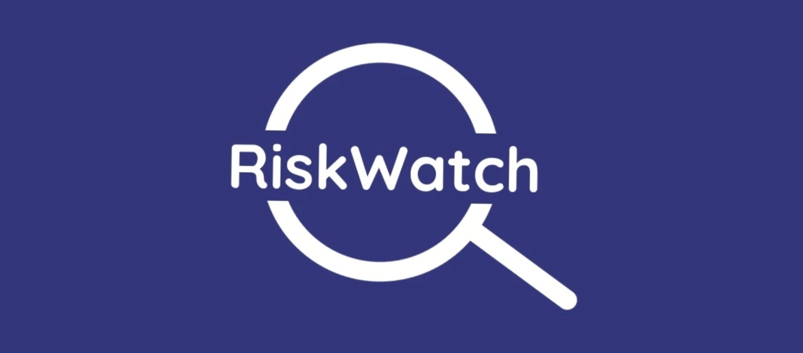
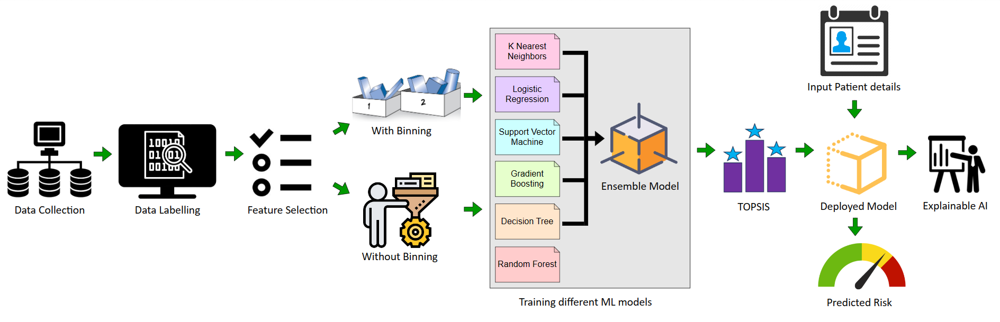
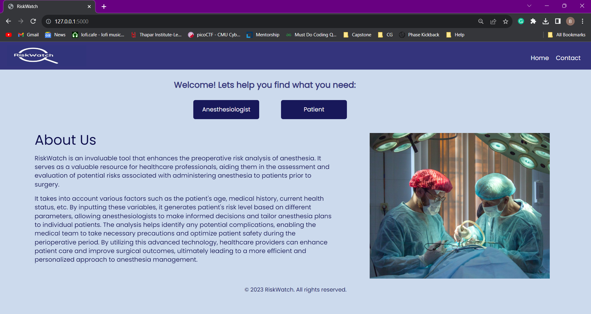
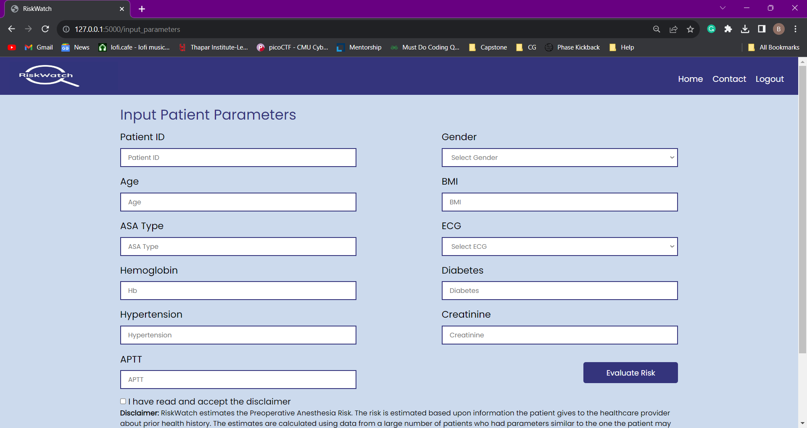
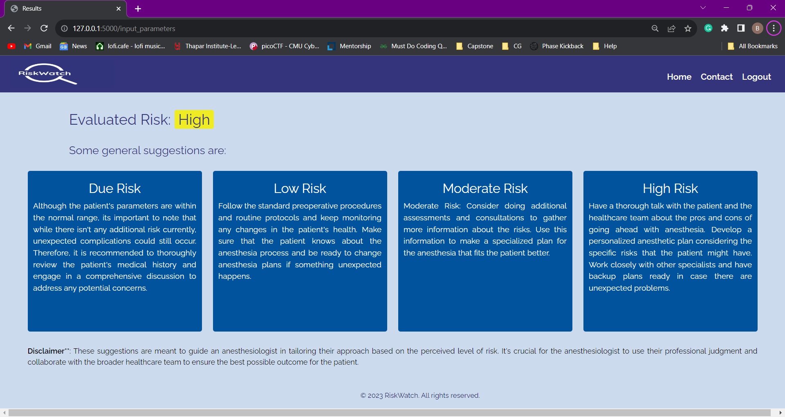
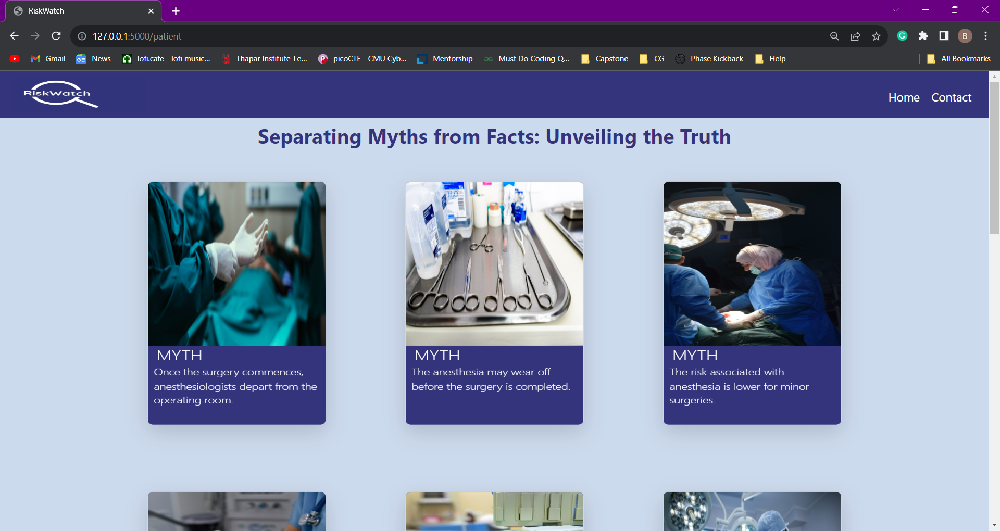

# RiskWatch - PreOperative Risk Analysis Of Anesthesia in ML

A user-friendly web application for anesthesiologists to help predict the risk associated with anaesthesia during medical surgeries using multi-class classification in ML.


## Demo

Here is a demo of the web application and how to use it!


## Technologies Used

 - [Flask in Python](https://flask.palletsprojects.com/en/3.0.x/)
 - [HTML/CSS](https://developer.mozilla.org/en-US/docs/Glossary/HTML5)
 - [JS](https://developer.mozilla.org/en-US/docs/Web/JavaScript)
 - [SQlite](https://www.sqlite.org/)
 - [Scikit Learn](https://scikit-learn.org/)
 - [Numpy,Pandas](https://numpy.org/)
 - [Pycaret](https://pycaret.org/)


## Badges


[](https://choosealicense.com/licenses/mit/)


## Documentation

RiskWatch is an invaluable tool that enhances the preoperative risk analysis of anaesthesia. It serves as a valuable resource for healthcare professionals, aiding them in the assessment and evaluation of potential risks associated with administering anesthesia to patients prior to surgery. 

For a thorough understanding of the working, check out!



[Research on RiskWatch](https://linktodocumentation)


## Deployment

To deploy this project, run

```bash
  python app.py
```


## Relevant Screenshots










## Authors

- [Bisman Kaur](https://github.com/BKaur20)
- [Simrata Kaur](https://github.com/simrata16)
- [Ekaspreet Kaur](https://github.com/Ekaspreet20)
- [Harjot Singh](https://github.com/harjot-singh-16)


## License

[MIT](https://choosealicense.com/licenses/mit/)

